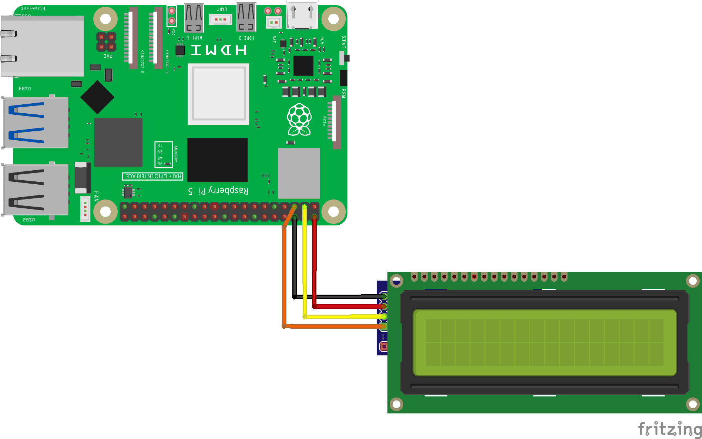

============================================================
Урок 17: LCD-дисплей 1602  🖥️
============================================================

Теоретическая часть
-------------------
LCD 16×2 с I²C-переходником на **PCF8574** подключается к Raspberry Pi всего по двум линиям (SDA и SCL).  
Дисплей выводит две строки по 16 символов, позволяет настраивать контраст и создавать до восьми пользовательских символов.

**Плюсы I²C-варианта:**

- Экономит GPIO-пины (только SDA/SCL).
- Совместим с 3,3 В логикой Raspberry Pi.
- Простая адресация (0x27 или 0x3F).

Необходимые компоненты
----------------------
- Raspberry Pi (4 / 5 / Zero 2 W)  
- LCD 16×2 с I²C-адаптером **PCF8574**  
- Соединительные провода «папа-папа»  
- (Опция) Резистор 220 Ω для ограничения яркости подсветки  

Схема подключения
-----------------

   **Рис. 1.** Подключение LCD к Raspberry Pi по I²C  
   VCC → 5 V | GND → GND | SDA → GPIO 2 | SCL → GPIO 3

Установка библиотек
-------------------
1. Активируйте I²C:

   .. code-block:: bash

      sudo raspi-config nonint do_i2c 0

2. Установите **RPLCD**:

   .. code-block:: bash

      pip install RPLCD

3. Узнайте адрес модуля:

   .. code-block:: bash

      i2cdetect -y 1

   В таблице появится 0x27 или 0x3F — используйте его в коде.

Запуск кода
-----------
1. Создайте папку ``lessons/lesson17/``.  
2. Сохраните скрипт ниже как ``lcd1602.py``.  
3. Запустите:

   .. code-block:: bash

      python lessons/lesson17/lcd1602.py

Код программы
-------------
Файл: ``lessons/lesson17/lcd1602.py``

.. code-block:: python

    from RPLCD.i2c import CharLCD
    import time

    # Параметры вашего дисплея
    lcd = CharLCD(
        i2c_expander='PCF8574',
        address=0x27,    # замените, если i2cdetect показал 0x3F
        port=1,
        cols=16,
        rows=2,
        dotsize=8
    )

    lcd.clear()                 # Очистка экрана
    lcd.write_string('helloworld')
    lcd.cursor_pos = (1, 0)     # Вторая строка, первый столбец
    lcd.write_string('Raspberry Pi 5')

    time.sleep(5)               # Пауза 5 с
    lcd.clear()                 # Очистка перед выходом

Разбор кода
-----------
- **CharLCD** — создаёт объект LCD; главные аргументы — тип расширителя, адрес I²C и размеры экрана.  
- **lcd.clear()** — очищает весь дисплей.  
- **lcd.write_string()** — выводит строку на текущей позиции курсора.  
- **lcd.cursor_pos = (row, col)** — перемещает курсор (нумерация строк с 0).  
- **time.sleep(5)** удерживает сообщение 5 секунд.

Ожидаемый результат
-------------------
1. Подсветка дисплея загорается.  
2. На первой строке появляется «helloworld».  
3. На второй строке — «Raspberry Pi 5».  
4. Через 5 с экран очищается.

Завершение
----------
Остановите скрипт **Ctrl + C** или дождитесь его завершения.  
Поздравляем — теперь вы умеете выводить текст на LCD 16×2 по I²C и можете добавлять визуальную индикацию в свои проекты!
