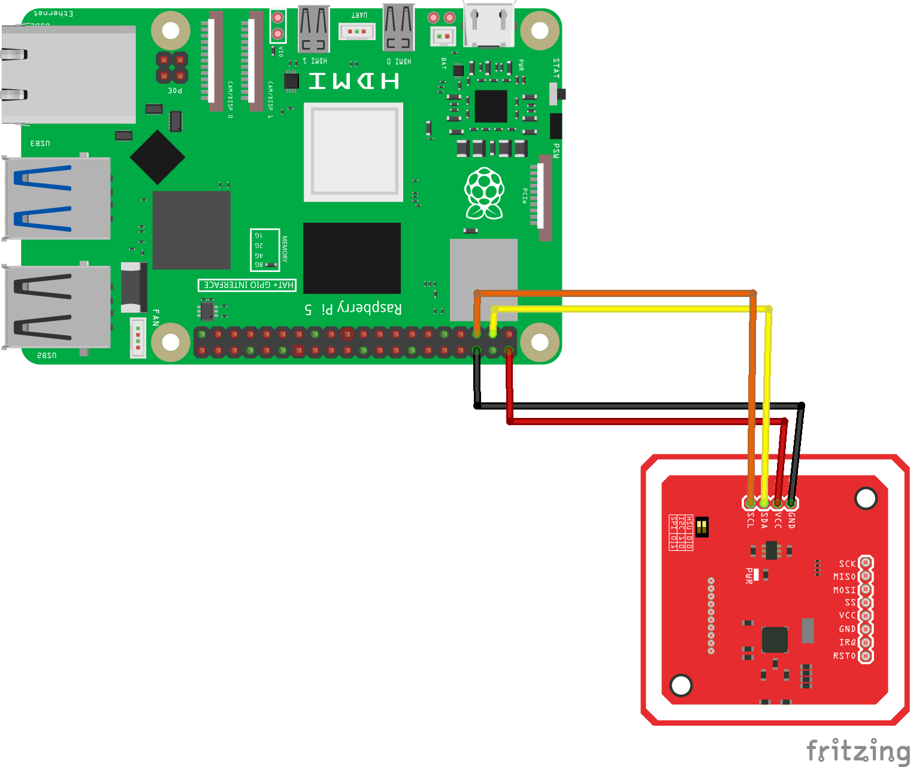

========================================================================================================================
Урок: Работа с RFID/NFC считывателем PN532 на Raspberry Pi
========================================================================================================================

Теоретическая часть
---------------------------------------------------------
RFID (Radio Frequency Identification) и NFC (Near Field Communication) технологии широко используются для бесконтактной идентификации объектов. Устройство PN532 — это популярный считыватель, который поддерживает различные стандарты RFID и NFC, включая ISO 14443A/MIFARE, FeliCa и ISO 14443B.

В этом уроке мы научимся:
- Подключать модуль PN532 к Raspberry Pi через I2C интерфейс
- Настраивать библиотеку CircuitPython для работы с модулем
- Считывать UID (уникальные идентификаторы) RFID/NFC карт и меток
- Выполнять базовые операции чтения/записи с картами

Необходимые компоненты
------------------------------------------------------------
- Raspberry Pi
- RFID/NFC считыватель PN532
- RFID-карты или NFC-метки для тестирования
- Соединительные провода
- Макетная плата (опционально)

Схема подключения
-------------------------------------------------------

Модуль PN532 может работать через разные интерфейсы: I2C, SPI или UART. В этом уроке мы используем I2C как наиболее простой вариант, требующий минимального количества проводов.

Установка необходимых библиотек
-------------------------------------------------
Для работы с PN532 через CircuitPython, нам потребуются следующие библиотеки:

.. code-block:: bash

   sudo apt-get update
   sudo apt-get install -y python3-pip
   
   # Включение I2C в Raspberry Pi, если ещё не включено
   sudo raspi-config
   # Выберите: Interfacing Options → I2C → Yes
   
   # Установка библиотек
   pip3 install adafruit-blinka
   pip3 install adafruit-circuitpython-pn532

После установки желательно проверить, определяется ли I2C-устройство:

.. code-block:: bash

   sudo i2cdetect -y 1

Вы должны увидеть устройство по адресу 0x24 (типичный адрес PN532).

Базовый код для работы с PN532
------------------------------------------------
Создайте файл `rfid_basic.py` и вставьте следующий код:

.. code-block:: python

   import board
   import busio
   import digitalio
   from adafruit_pn532.i2c import PN532_I2C

   # I2C-шина и пин reset
   i2c = busio.I2C(board.SCL, board.SDA)
   reset = digitalio.DigitalInOut(board.D25)

   pn532 = PN532_I2C(i2c, debug=False, reset=reset)

   ic, ver, rev, support = pn532.firmware_version
   print(f"PN532 v{ver}.{rev} — IC 0x{ic:x}")

   pn532.SAM_configuration()          # включаем чтение карт
   print("Поднесите NFC-метку…")

   while True:
       uid = pn532.read_passive_target(timeout=0.5)
       if uid:
           print("Найдена карта, UID:", uid.hex())

Запустите скрипт командой:

.. code-block:: bash

   python3 rfid_basic.py

Разбор кода для работы с PN532
------------------------------------------------

Рассмотрим ключевые части кода и объясним их назначение:

**Импорт библиотек:**

.. code-block:: python

   import board
   import busio
   import digitalio
   from adafruit_pn532.i2c import PN532_I2C

- `board` - модуль для работы с GPIO пинами Raspberry Pi
- `busio` - модуль для работы с коммуникационными интерфейсами (I2C, SPI, UART)
- `digitalio` - модуль для работы с цифровыми входами/выходами
- `PN532_I2C` - класс для работы с PN532 через I2C интерфейс

**Инициализация I2C и пина сброса:**

.. code-block:: python

   i2c = busio.I2C(board.SCL, board.SDA)
   reset = digitalio.DigitalInOut(board.D25)

Здесь мы создаем объект для I2C интерфейса, используя стандартные пины SCL и SDA на Raspberry Pi, и настраиваем пин GPIO25 как цифровой выход для сброса модуля.

**Создание объекта PN532:**

.. code-block:: python

   pn532 = PN532_I2C(i2c, debug=False, reset=reset)

Создаем объект для работы с PN532 через I2C, передавая ему:
- объект I2C интерфейса
- флаг отладки (False - выключена)
- пин сброса (reset)

**Проверка подключения:**

.. code-block:: python

   ic, ver, rev, support = pn532.firmware_version
   print(f"PN532 v{ver}.{rev} — IC 0x{ic:x}")

Запрашиваем версию прошивки, чтобы убедиться, что модуль подключен и работает корректно. Это возвращает кортеж из четырех значений:
- `ic`: идентификатор микросхемы
- `ver`: основная версия прошивки
- `rev`: ревизия прошивки
- `support`: поддерживаемые функции

**Настройка Security Access Module (SAM):**

.. code-block:: python

   pn532.SAM_configuration()

Этот метод настраивает режим работы Security Access Module (SAM). Без явной конфигурации используются режимы по умолчанию:
- Нормальный режим (без использования SAM)
- IRQ пин не используется
- Виртуальная карта не используется

**Основной цикл считывания меток:**

.. code-block:: python

   while True:
       uid = pn532.read_passive_target(timeout=0.5)
       if uid:
           print("Найдена карта, UID:", uid.hex())

В бесконечном цикле мы пытаемся считать метку с таймаутом 0.5 секунды:
- `read_passive_target()` ищет карту/метку, совместимую с ISO14443A (включая MIFARE)
- Если метка найдена, метод возвращает ее UID в виде байтового массива
- Метод `hex()` преобразует байтовый массив в шестнадцатеричную строку для удобного отображения

Расширенный пример: чтение NDEF данных с NFC-меток
--------------------------------------------------------------------
NDEF (NFC Data Exchange Format) - это стандартный формат данных для NFC-меток. Давайте расширим наш код для чтения NDEF-сообщений с метки:

.. code-block:: python

   import board
   import busio
   import digitalio
   from adafruit_pn532.i2c import PN532_I2C
   import time
   
   # I2C-шина и пин reset
   i2c = busio.I2C(board.SCL, board.SDA)
   reset = digitalio.DigitalInOut(board.D25)
   
   pn532 = PN532_I2C(i2c, debug=False, reset=reset)
   
   ic, ver, rev, support = pn532.firmware_version
   print(f"PN532 v{ver}.{rev} — IC 0x{ic:x}")
   
   pn532.SAM_configuration()
   
   # Функция для чтения NDEF данных из метки
   def read_ndef_data(block_number=4):
       print("Поднесите NFC метку для чтения NDEF данных...")
       uid = None
       
       # Ждем метку
       while uid is None:
           uid = pn532.read_passive_target(timeout=0.5)
           time.sleep(0.1)
       
       print(f"Найдена метка, UID: {uid.hex().upper()}")
       
       try:
           # Пробуем прочитать блок данных (для MIFARE Classic)
           # Для MIFARE Ultralight и других меток процесс может отличаться
           if block_number is not None:
               # Аутентификация для MIFARE Classic (ключ по умолчанию)
               mifare_key = b"\xFF\xFF\xFF\xFF\xFF\xFF"
               if pn532.mifare_classic_authenticate_block(uid, block_number, 0, mifare_key):
                   print(f"Аутентификация успешна для блока {block_number}")
                   block_data = pn532.mifare_classic_read_block(block_number)
                   if block_data:
                       print(f"Данные блока {block_number}: {block_data.hex().upper()}")
                       # Пробуем интерпретировать как ASCII текст
                       text = ''.join([chr(b) if 32 <= b <= 126 else '.' for b in block_data])
                       print(f"ASCII: {text}")
                   else:
                       print("Ошибка чтения блока")
               else:
                   print("Ошибка аутентификации")
       except Exception as e:
           print(f"Ошибка при чтении данных: {e}")
   
   # Основной код
   while True:
       read_ndef_data()
       print("Ожидание 3 секунды перед следующей попыткой...")
       time.sleep(3)

Этот код пытается прочитать содержимое блока 4 карты MIFARE Classic, который часто содержит начало NDEF сообщения. Для других типов карт и меток может потребоваться другой подход.

Пример записи данных на MIFARE Classic карту
-------------------------------------------------------------
Для записи данных на MIFARE Classic карту можно использовать следующий код:

.. code-block:: python

   def write_mifare_block(block_number=4, data=None):
       if data is None or len(data) != 16:
           data = bytearray([0x00, 0x01, 0x02, 0x03, 0x04, 0x05, 0x06, 0x07,
                           0x08, 0x09, 0x0A, 0x0B, 0x0C, 0x0D, 0x0E, 0x0F])
       
       print("Поднесите MIFARE Classic карту для записи...")
       uid = None
       
       # Ждем карту
       while uid is None:
           uid = pn532.read_passive_target(timeout=0.5)
           time.sleep(0.1)
       
       print(f"Найдена карта, UID: {uid.hex().upper()}")
       
       try:
           # Аутентификация
           mifare_key = b"\xFF\xFF\xFF\xFF\xFF\xFF"  # Ключ по умолчанию
           if pn532.mifare_classic_authenticate_block(uid, block_number, 0, mifare_key):
               print(f"Аутентификация успешна для блока {block_number}")
               
               # Запись данных
               if pn532.mifare_classic_write_block(block_number, data):
                   print(f"Данные успешно записаны в блок {block_number}")
                   print(f"Записаны данные: {data.hex().upper()}")
               else:
                   print("Ошибка записи данных")
           else:
               print("Ошибка аутентификации")
               
       except Exception as e:
           print(f"Ошибка при записи данных: {e}")

**Важное замечание о безопасности**: Некоторые блоки на MIFARE Classic картах содержат важную служебную информацию, включая ключи аутентификации и биты доступа. Запись в эти блоки может привести к тому, что карта станет непригодной для использования. Обычно безопасно записывать в блоки данных, начиная с блока 4.

Интеграция с системами контроля доступа
--------------------------------------------------------
Можно создать простую систему контроля доступа, сохраняя разрешенные UID карт в файл или базу данных:

.. code-block:: python

   import board
   import busio
   import digitalio
   from adafruit_pn532.i2c import PN532_I2C
   import time
   import json
   
   # I2C-шина и пин reset
   i2c = busio.I2C(board.SCL, board.SDA)
   reset = digitalio.DigitalInOut(board.D25)
   
   pn532 = PN532_I2C(i2c, debug=False, reset=reset)
   
   ic, ver, rev, support = pn532.firmware_version
   print(f"PN532 v{ver}.{rev} — IC 0x{ic:x}")
   
   pn532.SAM_configuration()
   
   # Функция для загрузки разрешенных UID из файла
   def load_allowed_uids(filename="allowed_uids.json"):
       try:
           with open(filename, 'r') as file:
               return json.load(file)
       except (FileNotFoundError, json.JSONDecodeError):
           # Если файл не существует или поврежден, создаем пустой список
           return []
   
   # Функция для сохранения UID в файл
   def save_uid(uid, name="", filename="allowed_uids.json"):
       uids = load_allowed_uids(filename)
       
       # Проверяем, есть ли уже такой UID
       for entry in uids:
           if entry.get("uid") == uid:
               print(f"UID {uid} уже существует в базе")
               return False
       
       # Добавляем новый UID
       uids.append({"uid": uid, "name": name, "added": time.strftime("%Y-%m-%d %H:%M:%S")})
       
       # Сохраняем обновленный список
       with open(filename, 'w') as file:
           json.dump(uids, file, indent=4)
       
       print(f"UID {uid} успешно добавлен в базу")
       return True
   
   # Функция для проверки доступа
   def check_access(uid):
       allowed_uids = load_allowed_uids()
       
       for entry in allowed_uids:
           if entry.get("uid") == uid:
               print(f"Доступ разрешен для {entry.get('name', 'Неизвестный')}")
               return True
       
       print("Доступ запрещен: неизвестная карта")
       return False
   
   # Режим регистрации новых карт
   def registration_mode():
       print("=== РЕЖИМ РЕГИСТРАЦИИ ===")
       print("Поднесите карту для регистрации...")
       
       uid = None
       while uid is None:
           uid = pn532.read_passive_target(timeout=0.5)
           time.sleep(0.1)
       
       uid_hex = uid.hex().upper()
       print(f"Найдена карта, UID: {uid_hex}")
       
       name = input("Введите имя пользователя (или оставьте пустым): ")
       
       if save_uid(uid_hex, name):
           print("Карта успешно зарегистрирована!")
       else:
           print("Ошибка при регистрации карты.")
   
   # Режим проверки доступа
   def access_control_mode():
       print("=== РЕЖИМ КОНТРОЛЯ ДОСТУПА ===")
       print("Поднесите карту для проверки...")
       
       try:
           while True:
               uid = pn532.read_passive_target(timeout=0.5)
               
               if uid:
                   uid_hex = uid.hex().upper()
                   print(f"Найдена карта, UID: {uid_hex}")
                   
                   if check_access(uid_hex):
                       # Здесь можно добавить код для открытия двери, включения LED и т.д.
                       pass
                   
                   time.sleep(2)  # Пауза между считываниями
               
               time.sleep(0.1)
       
       except KeyboardInterrupt:
           print("\nРежим контроля доступа завершен.")
   
   # Главное меню
   while True:
       print("\n=== МЕНЮ ===")
       print("1. Режим регистрации карт")
       print("2. Режим контроля доступа")
       print("3. Выход")
       
       choice = input("Выберите опцию (1-3): ")
       
       if choice == "1":
           registration_mode()
       elif choice == "2":
           access_control_mode()
       elif choice == "3":
           print("Программа завершена.")
           break
       else:
           print("Неверный выбор. Попробуйте снова.")

Этот скрипт предоставляет простое меню для регистрации новых карт и проверки доступа. Разрешенные UID сохраняются в JSON-файле вместе с именами пользователей и датой регистрации.

Практические рекомендации
-------------------------------------------
1. **Расстояние чтения**: Модуль PN532 имеет относительно небольшой диапазон чтения (обычно до 5 см). Для оптимальных результатов держите карту или метку близко к антенне.

2. **Избегайте металлических поверхностей**: Металл может значительно снизить эффективность считывания. Старайтесь не размещать модуль на металлических поверхностях или вблизи них.

3. **Проверка наличия карты**: В режиме чтения могут быть ложные срабатывания, поэтому всегда проверяйте UID карты перед выполнением важных действий:

   .. code-block:: python

      uid = pn532.read_passive_target(timeout=0.5)
      if uid:
          # Работаем с картой
          pass

4. **Обработка ошибок**: Всегда добавляйте обработку исключений, особенно при работе с картами MIFARE, где может быть множество типов ошибок:

   .. code-block:: python

      try:
          # Код работы с картой
      except Exception as e:
          print(f"Ошибка: {e}")

5. **Безопасность ключей**: Если вы меняете ключи аутентификации на картах MIFARE Classic, всегда сохраняйте резервную копию ключей. Потеря ключей может сделать карту непригодной для использования.

Заключение
----------------------------
В этом уроке мы изучили основы работы с RFID/NFC считывателем PN532 на Raspberry Pi через I2C интерфейс. Мы рассмотрели:

- Базовое подключение и инициализацию считывателя
- Считывание UID карт и меток
- Чтение и запись данных на MIFARE Classic карты
- Создание простой системы контроля доступа

Теперь вы можете использовать эти знания для создания собственных проектов с использованием RFID/NFC технологий, таких как:
- Системы контроля доступа
- Электронные платежные системы
- Учет посещаемости
- Интерактивные экспонаты и игры

Дополнительные материалы
-----------------------------------------
1. [Документация CircuitPython для PN532](https://circuitpython.readthedocs.io/projects/pn532/en/latest/)
2. [Спецификация стандарта NDEF](https://developer.android.com/develop/connectivity/nfc/nfc/advanced-nfc.html)
3. [Руководство по работе с MIFARE Classic](https://www.nxp.com/docs/en/data-sheet/MF1S50YYX_V1.pdf)
