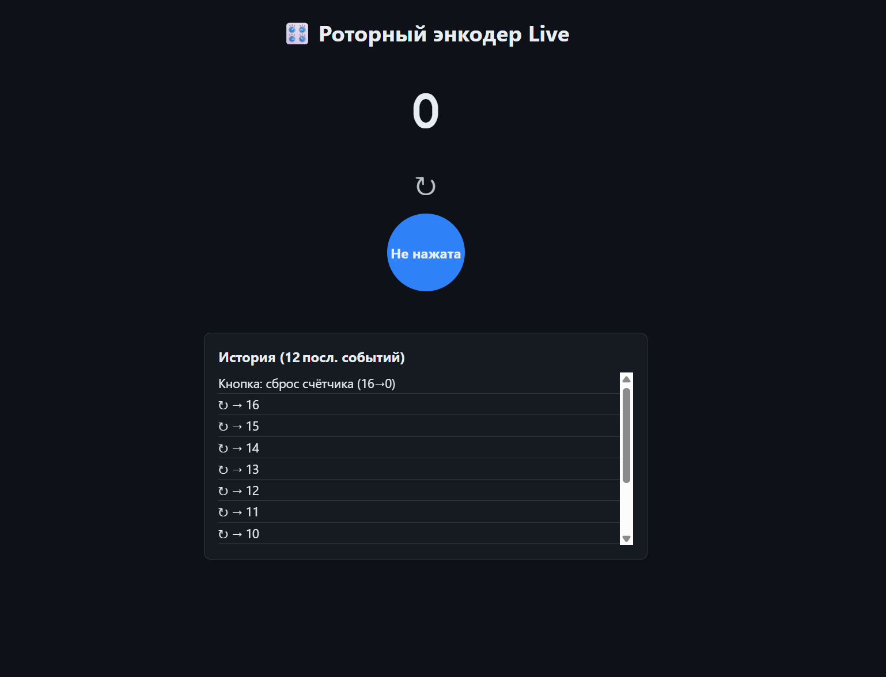

============================================================
Энкодер с веб-интерфейсом
============================================================

Теоретическая часть
-----------------------------------
Роторный энкодер — это устройство ввода, которое преобразует угловое положение вала в цифровой код. В отличие от потенциометра, энкодер может вращаться бесконечно и позволяет определять не только значение, но и направление вращения. Большинство роторных энкодеров также оснащены кнопкой, срабатывающей при нажатии на вал.

В этом уроке мы создадим систему мониторинга роторного энкодера через веб-интерфейс, используя:
- CircuitPython для прямой работы с GPIO и считывания данных с энкодера
- Flask для создания веб-сервера и API
- HTML, CSS и JavaScript для построения интерактивного веб-интерфейса
- Многопоточность для параллельной обработки веб-запросов и опроса энкодера

Такая система может использоваться в различных проектах умного дома, аудиосистемах, пользовательских интерфейсах и других устройствах, где требуется точное управление параметрами.

Необходимые компоненты
--------------------------------------
- Raspberry Pi
- Роторный энкодер с кнопкой
- Соединительные провода
- Устройство с браузером для доступа к веб-интерфейсу (смартфон, планшет, компьютер)

Схема подключения
---------------------------------
.. figure:: images/rotary_encoder.jpg
   :width: 80%
   :align: center

   **Рис. 1:** Схема подключения роторного энкодера

Подключите роторный энкодер к Raspberry Pi следующим образом:
- Вывод A энкодера -> GPIO17
- Вывод B энкодера -> GPIO18
- Вывод кнопки -> GPIO27
- GND -> GND
- VCC (+) -> 3.3V

Установка необходимых библиотек
-----------------------------------------------
Перед запуском кода установите Flask и adafruit-blinka (базовая библиотека CircuitPython):

.. code-block:: bash

   pip install flask adafruit-blinka

Структура проекта
---------------------------------
Создайте следующую структуру файлов:

.. code-block:: bash

   lessons/
   └── encoder_web/
       ├── app.py            # Основное Flask-приложение
       └── templates/
           └── index.html    # HTML-шаблон для веб-интерфейса

Код программы
-----------------------------
**Файл app.py**

.. code-block:: python

   from flask import Flask, jsonify, render_template
   import digitalio, board, threading, time
   
   # ──────────── GPIO ────────────
   PIN_A = digitalio.DigitalInOut(board.D17)
   PIN_B = digitalio.DigitalInOut(board.D18)
   BTN   = digitalio.DigitalInOut(board.D27)
   
   for pin in (PIN_A, PIN_B, BTN):
       pin.direction = digitalio.Direction.INPUT
       pin.pull      = digitalio.Pull.UP      # энкодер «замыкает на GND»
   
   # ──────────── глобальное состояние ────────────
   counter = 0
   direction = "—"
   button_pressed = False
   events = []
   
   _lock = threading.Lock()
   
   # ──────────── квадратурная таблица (Gray) ────────────
   # transition = (prev<<2)|curr  → ±1 / 0 / error
   _STEP_TAB = {
       0b0001: +1, 0b0010: -1, 0b0100: -1, 0b0111: +1,
       0b1000: +1, 0b1011: -1, 0b1101: -1, 0b1110: +1,
   }
   
   # ──────────── поток опроса ────────────
   def encoder_worker():
       global counter, direction, button_pressed, events
       last_state = (PIN_A.value << 1) | PIN_B.value
       last_btn   = BTN.value
       btn_time   = time.monotonic()
   
       while True:
           now_state = (PIN_A.value << 1) | PIN_B.value
           transition = (last_state << 2) | now_state
           step = _STEP_TAB.get(transition, 0)
           if step:
               counter += step
               direction = "↻" if step > 0 else "↺"
               with _lock:
                   events.append(f"{direction}  →  {counter}")
                   events[:] = events[-12:]
           last_state = now_state
   
           # — антидребезг кнопки (20 мс) —
           curr_btn = BTN.value
           if curr_btn != last_btn:
               btn_time = time.monotonic()
               last_btn = curr_btn
           elif not curr_btn and (time.monotonic() - btn_time) > 0.02:
               # нажатие подтверждено
               if not button_pressed:
                   button_pressed = True
                   with _lock:
                       events.append(f"Кнопка: сброс счётчика ({counter}→0)")
                       counter = 0
                       events[:] = events[-12:]
           else:
               button_pressed = False
   
           time.sleep(0.001)   # 1 кГц опроса
   
   # ──────────── Flask ────────────
   app = Flask(__name__)
   
   @app.route("/")
   def index():
       return render_template("index.html")      # ваш шаблон
   
   @app.route("/api/state")
   def state():
       with _lock:
           return jsonify(
               counter=counter,
               direction=direction,
               button=button_pressed,
               events=list(events),
           )
   
   # ──────────── запуск ────────────
   if __name__ == "__main__":
       threading.Thread(target=encoder_worker, daemon=True).start()
       app.run(host="0.0.0.0", port=5000, threaded=True)

**Файл templates/index.html**

.. code-block:: html

      <!DOCTYPE html>
      <html lang="ru">
      <head>
          <meta charset="UTF-8">
          <meta name="viewport" content="width=device-width, initial-scale=1.0">
          <title>Монитор энкодера</title>
          
      </head>
      <body>
          <h1>🎛️ Роторный энкодер Live</h1>
          
0

          
—

          
Кнопка

      
          

              <h3>История (12 посл. событий)</h3>
              

          

      
      
      </body>
      </html>

# Разбор кода»

## Разбор *web\_encoder.py*

1. Настройка GPIO

   .. code-block:: python

      PIN_A = digitalio.DigitalInOut(board.D17)
      PIN_B = digitalio.DigitalInOut(board.D18)
      BTN   = digitalio.DigitalInOut(board.D27)

      for pin in (PIN_A, PIN_B, BTN):
          pin.direction = digitalio.Direction.INPUT
          pin.pull      = digitalio.Pull.UP

   *A* и *B*‑каналы энкодера и кнопка подключены как входы с подтяжкой
   к VCC. В «покое» — логическая 1; при замыкании на GND — логический 0.

2. Квадратурный декодер ×4

   .. code-block:: python

      _STEP_TAB = {
          0b0001:+1, 0b0010:-1, 0b0100:-1, 0b0111:+1,
          0b1000:+1, 0b1011:-1, 0b1101:-1, 0b1110:+1,
      }

      transition = (prev_state << 2) | curr_state
      step       = _STEP_TAB.get(transition, 0)

   Таблица переходов выдаёт ``+1`` или ``-1`` на каждый фронт, тем
   самым получаем максимальную «разрешающую способность» энкодера.

3. Антидребезг кнопки

   .. code-block:: python

      if not BTN.value and (now - t_press) > 0.02:
          counter = 0

   Кнопка считается нажатой, если уровень LOW удерживается не менее
   20 мс.

4. Поток и блокировка

   .. code-block:: python

      _lock = threading.Lock()
      with _lock:
          events.append(...)

   Все операции с ``counter`` и ``events`` защищены ``Lock``‑ом, чтобы
   избежать гонок между фоновым потоком и Flask‑маршрутами.

5. REST‑маршрут

   .. code-block:: python

      @app.route('/api/state')
      def state():
          with _lock:
              return jsonify(...)

   Возвращает JSON c текущим счётчиком, направлением, состоянием
   кнопки и последними 12 событиями.

## Разбор *index.html*

1. Стилизация

   * Тёмная тема с переменными ``--bg``/``--fg``.
   * Крупный моноширинный счётчик ``.counter``.
   * Кнопка‑индикатор ``.btn-state`` (синий — отпущена, красный — нажата).
   * Прокручиваемый список событий ``.list``.

2. JavaScript

   .. code-block:: javascript

      function update(){
        fetch('/api/state').then(r=>r.json()).then(d=>{ ... });
      }
      setInterval(update, 150);

   * Раз в 150 мс запрашивает JSON и обновляет DOM.
   * История событий хранится и выводится в обратном порядке — свежие
     события отображаются сверху.

*Вывод*: новый алгоритм (таблица переходов + дебаунс) обеспечивает
надёжное считывание даже при быстром вращении, а фронтенд отражает данные
почти в реальном времени без лишней нагрузки на сеть и CPU.

Запуск программы
-------------------------------
1. Сохраните файлы в соответствующих директориях
2. Запустите Flask-приложение:

    .. code-block:: bash

        python3 lessons/encoder_web/app.py

3. Откройте браузер и перейдите по адресу: http://<IP_Raspberry_Pi>:5000
   - где <IP_Raspberry_Pi> - IP-адрес вашего Raspberry Pi в локальной сети
   - например: http://192.168.1.100:5000

Ожидаемый результат
-----------------------------------
После запуска приложения вы увидите веб-страницу с информацией о состоянии роторного энкодера:

1. Большой счетчик в центре страницы, отображающий текущее значение
2. Индикатор направления последнего вращения
3. Круглый индикатор состояния кнопки, меняющий цвет при нажатии
4. Список последних событий (вращения и нажатия кнопки)

   **Рис. 2:** Пример веб-интерфейса для роторного энкодера

Теперь вы можете:
- Вращать энкодер и наблюдать изменение счетчика
- Нажимать на кнопку энкодера для сброса счетчика
- Видеть все события в журнале
- Контролировать энкодер с любого устройства в сети

Практические применения
--------------------------------------
Роторные энкодеры с веб-интерфейсом могут использоваться во множестве проектов:

1. **Системы управления умным домом**:
   - Регулировка яркости освещения
   - Управление температурой и климатом
   - Настройка параметров аудиосистемы

2. **Пользовательские интерфейсы для устройств**:
   - Выбор пунктов меню на дисплеях
   - Ввод данных в медицинских или промышленных устройствах
   - Управление настройками 3D-принтеров или ЧПУ-станков

3. **Образовательные и демонстрационные стенды**:
   - Наглядная демонстрация принципов работы энкодеров
   - Создание интерактивных экспонатов для музеев

4. **Аудиотехника**:
   - Регулировка громкости с точным контролем
   - Управление эквалайзером или эффектами
   - Выбор треков или настройка параметров воспроизведения

Дополнительные задания
-------------------------------------
1. **Добавление визуализации направления**: Добавьте стрелки или анимацию для наглядного отображения направления вращения.
2. **Управление устройствами**: Подключите реле или другие устройства, которыми можно управлять через счетчик энкодера.
3. **Настраиваемые действия**: Добавьте возможность назначать разные действия для разных значений счетчика.
4. **Сохранение состояния**: Реализуйте сохранение состояния счетчика в файл, чтобы оно восстанавливалось после перезапуска.
5. **Длительное нажатие**: Добавьте детектирование длительного нажатия кнопки для выполнения альтернативных действий.

Завершение работы
--------------------------------
Для остановки программы нажмите **Ctrl + C** в терминале. Обратите внимание, что поток опроса энкодера автоматически завершится благодаря использованию daemon-потока.

Поздравляем! 🎉 Вы успешно создали систему мониторинга роторного энкодера через веб-интерфейс. Этот проект демонстрирует, как можно объединить физические устройства ввода с современными веб-технологиями для создания интуитивных и удобных интерфейсов управления.
