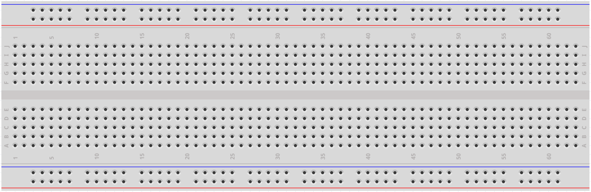
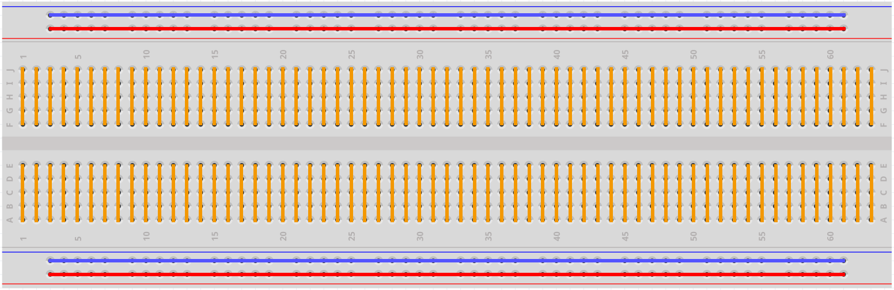

Breadboard
==============

Макетная плата (breadboard) — это основа для прототипирования электронных схем.
Изначально термин обозначал доску для нарезки хлеба, отшлифованный деревянный брусок.
В 1970-х появились бессвинцовые макетные платы (также называемые solderless breadboard, plugboard или terminal array board), и сегодня слово «breadboard» обычно относится именно к ним.

Макетная плата позволяет быстро собирать и проверять схемы до окончательной разводки печатной платы.
В многочисленные отверстия можно вставлять компоненты — микросхемы, резисторы и т. д., а также соединительные провода (джамперы).
Плата даёт возможность легко устанавливать и извлекать детали, не прибегая к пайке.

На рисунке ниже показано внутреннее устройство макетной платы.
Хотя отверстия кажутся независимыми, внутри они соединены между собой металлическими шинами.

