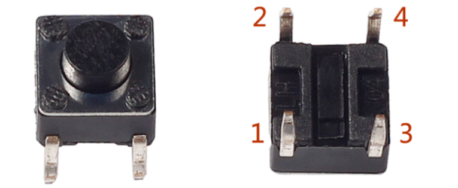
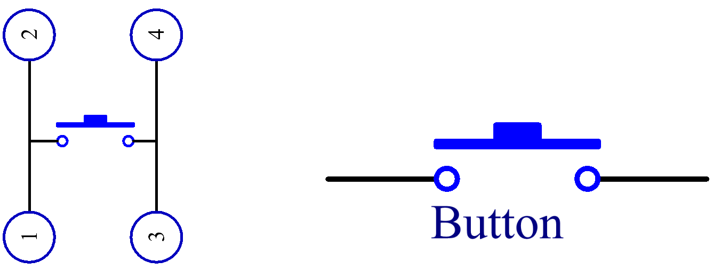

Кнопка
==========

Кнопки — это распространённые компоненты, используемые для управления электронными устройствами. Обычно они служат в качестве выключателей для замыкания или размыкания цепей. Хотя кнопки бывают разных размеров и форм, здесь используется мини-кнопка размером 6 мм, как показано на изображении ниже.

Выводы 1 и 2 соединены между собой, а выводы 3 и 4 — между собой. Поэтому достаточно соединить либо вывод 1 или 2 с выводом 3 или 4.

Ниже представлена внутренняя структура кнопки. Символ справа внизу обычно используется для обозначения кнопки на схемах.

Так как выводы 1 и 2 соединены, и выводы 3 и 4 тоже, при нажатии кнопки все 4 вывода оказываются соединены, замыкая тем самым цепь.

Примеры
-------

* :doc:`Подключение кнопки  </circuitPythonLessons/module1/lesson2/button>`
