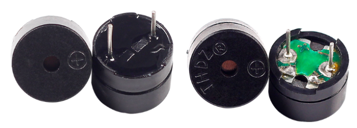
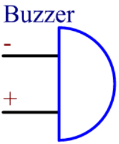

Зуммер (Buzzer)
===============

Зуммер — это электронный звукоизлучатель с интегрированной схемой,
питаемый постоянным током. Широко применяется в компьютерах,
принтерах, копирах, сигнализациях, электронных игрушках, автомобильной
электронике, телефонах, таймерах и других устройствах, где требуется звук.

Существуют **активные** и **пассивные** зуммеры (см. рисунок ниже).
Если перевернуть зуммер контактами вверх, то плата с **зелёным** текстолитом
‐ пассивный зуммер, а корпус с чёрной защитной плёнкой
‐ активный.

**Отличие активного и пассивного зуммера**

* **Активный** зуммер содержит встроённый генератор: достаточно подать
  питание, и он сразу издаёт звук.
* **Пассивный** зуммер генератора не имеет, поэтому при подаче постоянного
  напряжения он молчит; для звучания его нужно возбуждать
  прямоугольным сигналом частотой ~2–5 кГц.
  Из-за встроенных схем активный зуммер обычно дороже пассивного.

Ниже приведён условный графический символ зуммера.
Два вывода имеют полярность: контакт « + » обозначает анод,
второй – катод.

Полярность можно определить и по длине ножек: длинная — анод,
короткая — катод. Если перепутать выводы, зуммер не будет звучать.

Дополнительная информация: `Buzzer — Википедия <https://ru.wikipedia.org/wiki/Зуммер>`_

**Примеры**

