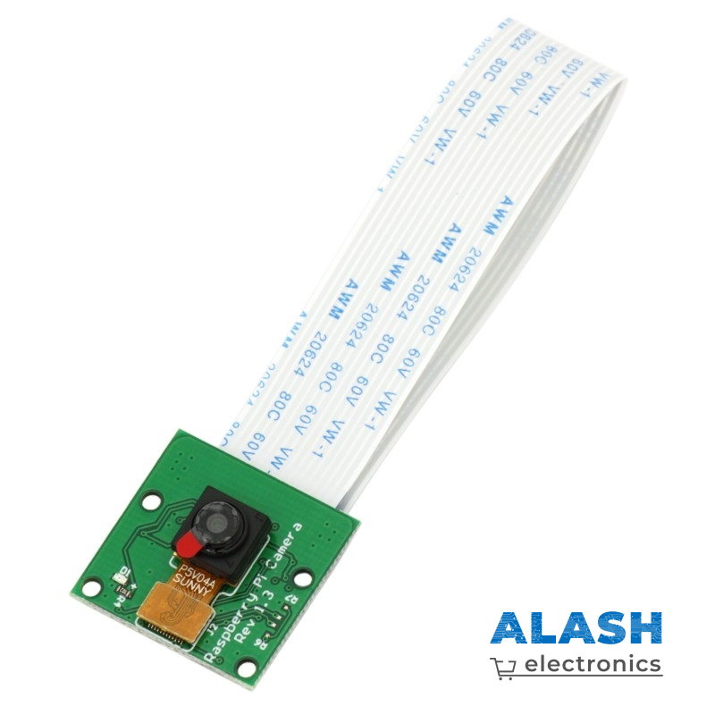
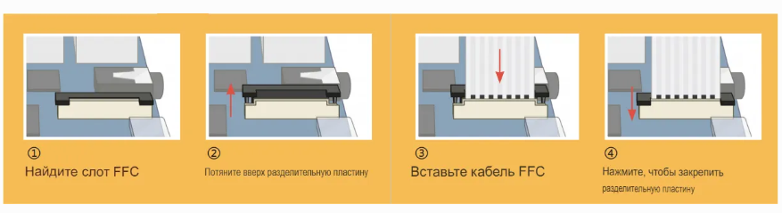
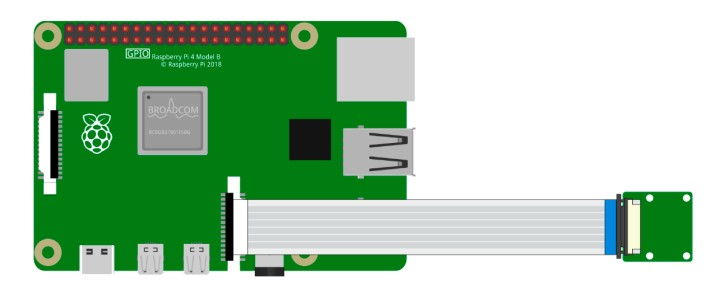

Модуль камеры
====================================

Это 5-мегапиксельный модуль камеры для Raspberry Pi на сенсоре **OV5647**.
Достаточно подключить прилагаемый шлейф к порту **CSI** (Camera Serial
Interface) на плате Raspberry Pi — и камера готова к работе.

Плата миниатюрная — всего **25 × 23 × 9 мм** и весит около **3 г**,
поэтому отлично подходит для мобильных и других проектов, критичных к
габаритам и массе.  Камера имеет фиксированный объектив и делает снимки
разрешением **2592 × 1944 px** (5 Мп), а также поддерживает видео
1080p @ 30 fps, 720p @ 60 fps и 640 × 480 @ 90 fps.

.. note::

   Камера захватывает только изображение и видео **без звука**.

**Характеристики**

* **Фотосъёмка:** 2592 × 1944 px  
* **Видео:**  
  * 1080p @ 30 кадров/с  
  * 720p  @ 60 кадров/с  
  * 640×480 @ 60 / 90 кадров/с
* **Диафрагма:** f/1.8  
* **Угол обзора:** 65 °  
* **Размеры:** 24 × 23,5 × 8 мм  
* **Вес:** 3 г  
* **Интерфейс:** разъём CSI  
* **Поддерживаемая ОС:** Raspberry Pi OS (рекомендуется последняя версия)

Сборка и подключение
--------------------

На камере и на плате Raspberry Pi расположен один и тот же плоский
пластиковый разъём. Осторожно выдвиньте чёрную защёлку разъёма,
вставьте шлейф FFC согласно рисунку и задвиньте защёлку обратно.

Шлейф должен входить ровно и не выпадать при лёгком подтягивании. Если
шлейф сидит неплотно, повторите установку.

.. warning::

   Подключайте камеру **только при выключенном питании** Raspberry Pi —
   это предотвратит повреждение устройства.

Примеры
-------

* :doc:`Работа с камерой Raspberry Pi </circuitPythonLessons/module1/lesson19/camera>`

