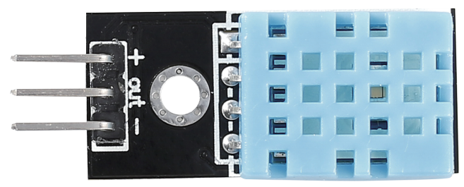
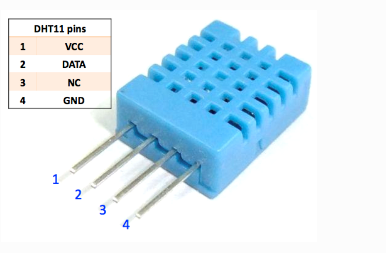

Датчик температуры и влажности (DHT11)
======================================

DHT11 — цифровой комбинированный датчик, обеспечивающий калиброванный
выход температуры и относительной влажности воздуха.  
Сочетание специализированного модуля обработки сигнала и
чувствительных элементов обеспечивает высокую надёжность и долгосрочную
стабильность показаний.

Подключение
-----------

================  =============================
VCC               Питание (+3.3 В … 5 В)
GND               Общий провод
DATA              Двухсторонний цифровой сигнал
================  =============================

Обмен данными
-------------

1. **Ведущий** (микроконтроллер) формирует стартовый импульс на линии
   **DATA**.
2. **DHT11** отвечает импульсом подтверждения.
3. Затем датчик последовательно отправляет **40 бит** информации:

   * 8 бит — целая часть влажности  
   * 8 бит — дробная часть влажности  
   * 8 бит — целая часть температуры  
   * 8 бит — дробная часть температуры  
   * 8 бит — контрольная сумма (checksum)

Характеристики
--------------

* Диапазон влажности: **20 % … 90 % RH** (±5 % RH)  
* Диапазон температуры: **0 °C … 50 °C** (±2 °C)  
* Период обновления данных: **≈ 1 с**  
* Питание: **3.3 – 5 В**, потребление ≤ 2.5 мА (измерение)

Дополнительная информация — в официальном
`даташите на DHT11 <https://components101.com/sites/default/files/component_datasheet/DHT11-Temperature-Sensor.pdf>`_.

Примеры
-------

* :doc:`Датчик DHT11 </circuitPythonLessons/module1/lesson6>`
* :doc:`Веб сайт для управления сервоприводом </circuitPythonLessons/module2/lesson8>`

