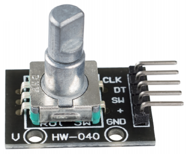
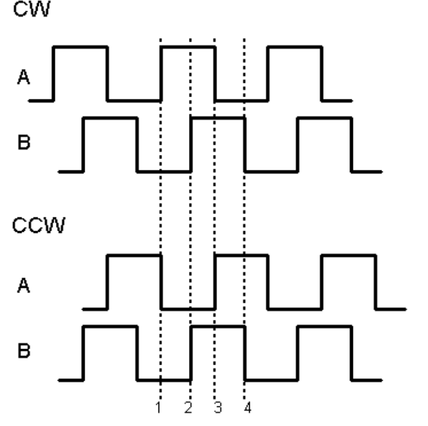

Энкодер
=============================

Поворотный энкодер — это датчик положения, который преобразует
вращение ручки в цифровой сигнал и позволяет определить направление
поворота.

Энкодер можно считать «цифровым» аналогом потенциометра, но с
большими возможностями:

* Ручка может вращаться **неограниченно** (у потенциометра угол
  ограничен).
* Энкодер сообщает не абсолютный угол, а **изменение положения**
  (шаги вперёд/назад).

Существует два основных типа энкодеров:

* **Абсолютные** — сообщают абсолютное положение вала.
* **Инкрементальные** (или относительные) — фиксируют только шаги и
  направление.  
  В нашем наборе используется именно **инкрементальный** энкодер.

Инкрементальный энкодер формирует два квадратных сигнала — каналы
**A** и **B**, сдвинутые по фазе на 90°.

Как определить направление вращения
-----------------------------------

* При переходе канала **A** из HIGH в LOW:
  * если в этот момент **B** = HIGH → вращение по
    часовой стрелке (**CW**);
  * если в этот момент **B** = LOW → вращение
    против часовой стрелки (**CCW**).

Таким образом, достаточно считывать состояние канала **B** в момент
спада сигнала **A**, чтобы узнать направление шага.

Примеры
-------

* :ref:`2.1.6_c` — проект на C  
* :ref:`2.1.6_py` — проект на Python
