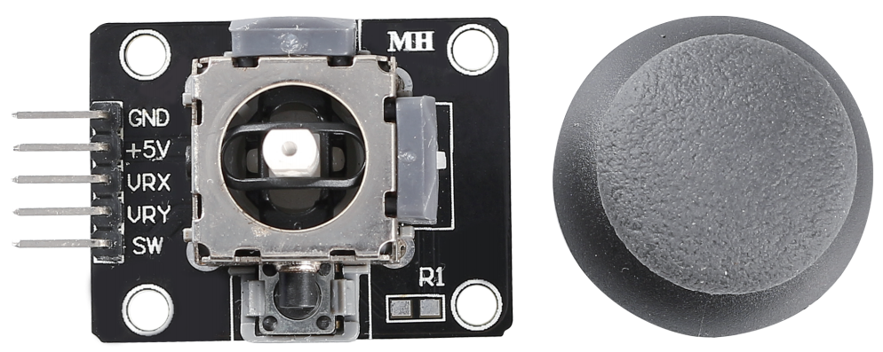
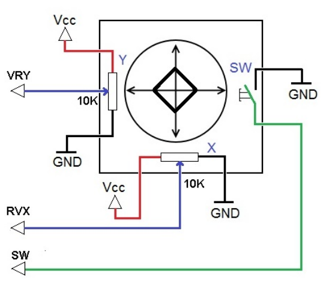

Модуль джойстика
=======================

Основная идея джойстика заключается в преобразовании перемещения ручки в
электронные сигналы, которые может обработать микроконтроллер или
компьютер.

Чтобы передать полный диапазон движений, джойстик измеряет положение
ручки по двум осям:

* **Ось X** — левое/правое смещение  
* **Ось Y** — верх/низ  

Точка с координатами X-Y однозначно задаёт положение ручки.

В классическом аналоговом джойстике положение определяют два
потенциометра (переменных резистора), закреплённые на валу каждой из
осей. Изменение сопротивления преобразуется в аналоговый сигнал,
соответствующий координате.

Кроме того, у джойстика есть **цифровая кнопка**, срабатывающая при
нажатии ручки вниз.

**Примеры**

