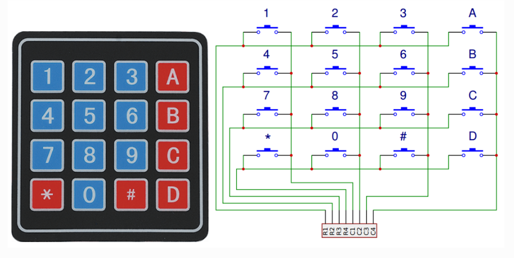

Клавиатура (Keypad)
===================

Клавиатура-матрица представляет собой прямоугольный массив из 12 или 16
кнопок типа OFF-(ON). Контакты выведены на гребёнку-разъём, к которой
можно подсоединить шлейфовый кабель или впаять её в печатную плату.
В части моделей каждой кнопке соответствует отдельный вывод, где все
кнопки имеют общий «земляной» провод.

Чаще встречается **матричная разводка**: каждая кнопка замыкает
уникальную пару проводников в матрице. Такой способ удобен для опроса
микроконтроллером. Контроллер поочерёдно подаёт импульс на каждую из
четырёх горизонтальных строк, а во время импульса проверяет четыре
вертикальных столбца, чтобы выяснить, какой из них получает сигнал.
Чтобы входы микроконтроллера не «плавали» в открытом состоянии,
к вертикальным линиям добавляют подтягивающие резисторы (pull-up /
pull-down).

Примеры проектов
----------------

