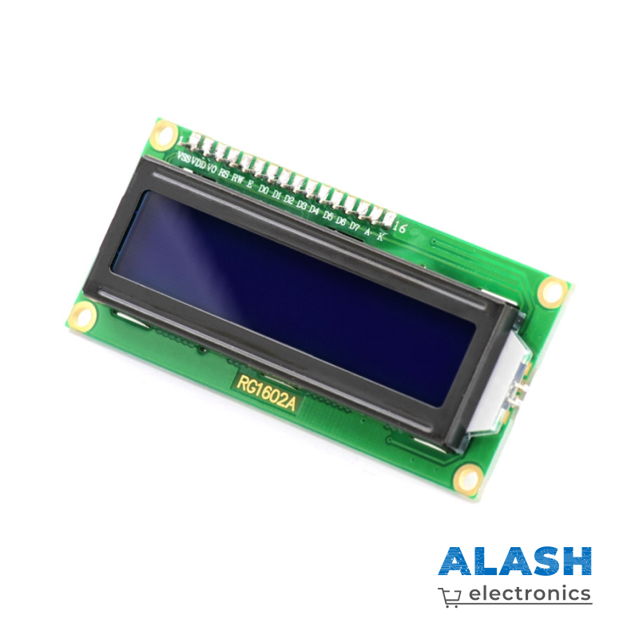
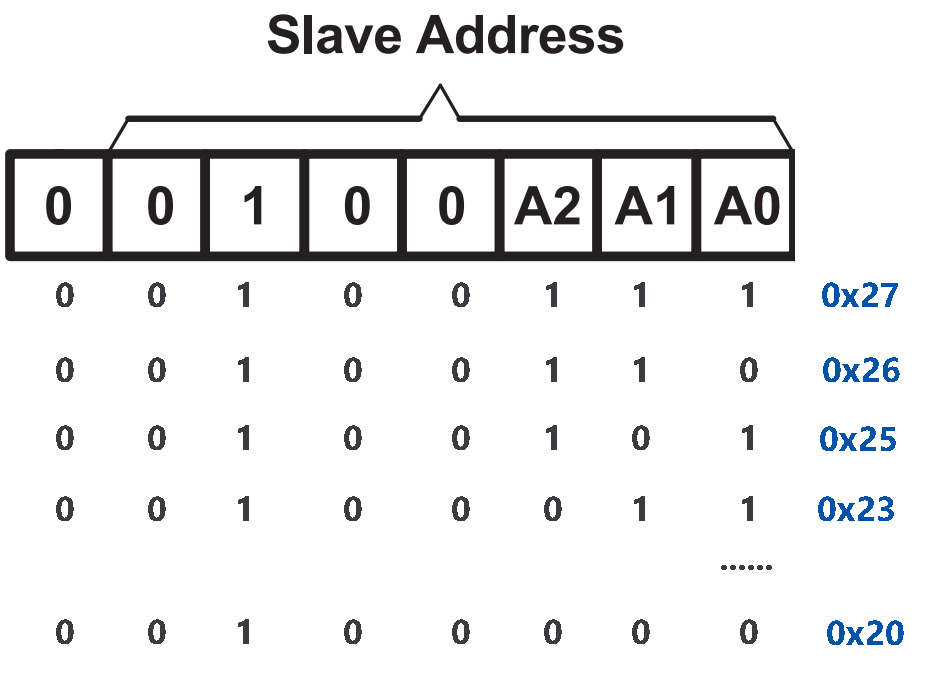
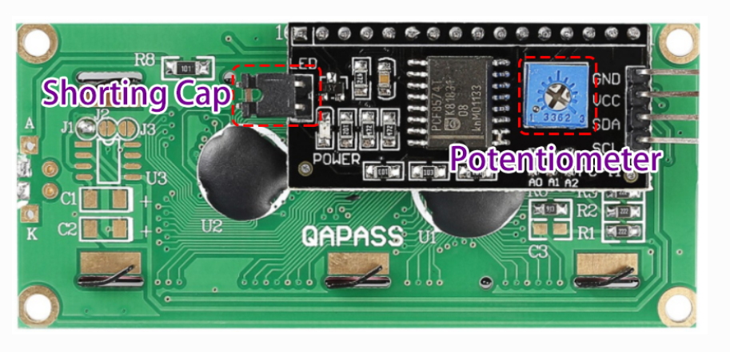

LCD1602
==============

* **GND** — земля  
* **VCC** — питание **5 В**  
* **SDA** — линия последовательных данных (подтянуть к VCC через
  резистор)  
* **SCL** — линия тактирования (подтянуть к VCC через резистор)

Стандартные LCD-дисплеи требуют множества выводов микроконтроллера, что
ограничивает использование других периферийных устройств.  
Для решения этой проблемы используется плата-адаптер на микросхеме
**PCF8574**, преобразующей интерфейс **I²C → параллельный** для
дисплея LCD1602.

* `PCF8574 – даташит <https://www.ti.com/lit/ds/symlink/pcf8574.pdf>`_

Адрес I²C
---------

По умолчанию адрес чаще всего **0x27**, реже встречается **0x3F**.

Адрес можно изменить, замыкая перемычки **A0/A1/A2**:  
в исходном состоянии они лог. 1; при замыкании — лог. 0.

Подсветка и контраст
--------------------

* **Перемычка (Jumper)** — включает подсветку; снимите перемычку,
  чтобы подсветку отключить.  
* **Регулировочный потенциометр** — задаёт контраст: по часовой стрелке
  контраст ↑, против — ↓.

Примеры
-------

* :doc:`LCD1602 </circuitPythonLessons/module1/lesson17>`
* :doc:`Веб-интерфейс для управления LCD1602 </circuitPythonLessons/module2/lesson17>`
