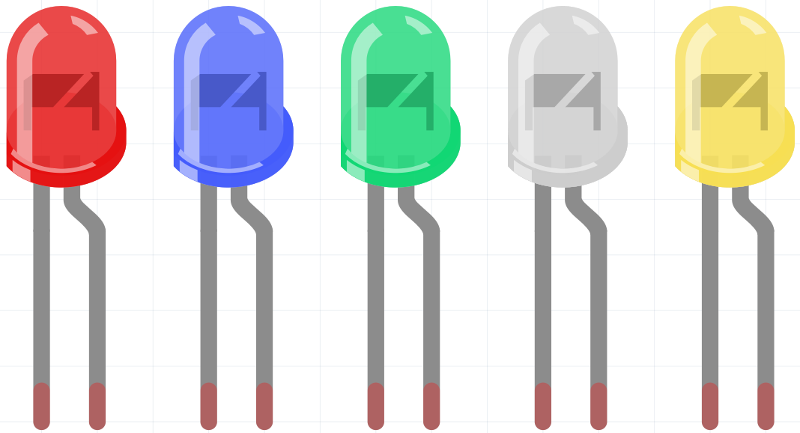
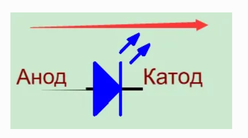

Светодиод (LED)
===============

**Светодиод** (Light-Emitting Diode) — это полупроводниковый прибор,  
который преобразует электрическую энергию в световую за счёт PN-перехода.  
По длине волны излучения различают:

* **лазерные диоды**,  
* **инфракрасные ИК-светодиоды**,  
* **видимые светодиоды**, которые чаще всего и называют просто LED.

--------------------------------------------------------------------
Принцип работы и полярность
--------------------------------------------------------------------

У диода **односторонняя проводимость**: ток протекает только от анода к катоду  
(см. направление стрелки на условном обозначении).

У светодиода два вывода:

* длинный вывод — **анод (+)**,  
* короткий вывод — **катод (−)**.

Важно не перепутать полярность при подключении.

--------------------------------------------------------------------
Нужен ли токоограничивающий резистор?
--------------------------------------------------------------------

У каждого LED есть фиксированное **падение напряжения** (``V_D``):

* красный, жёлтый, зелёный — ≈ 1.8 В  
* белый — ≈ 2.6 В  

Большинство светодиодов рассчитаны на **Imax ≈ 20 мА**.  
Если подать питание напрямую, источник может «перебороть» ``V_D`` и  
перепустить ток, что приведёт к перегоранию диода.  
Поэтому **обязательно** ставят последовательный резистор.

Формула для расчёта сопротивления:

.. code:: text

   R = (V_supply − V_D) / I

где  

* ``R`` — сопротивление резистора (Ом),  
* ``V_supply`` — напряжение питания,  
* ``V_D`` — падение напряжения на LED,  
* ``I`` — рабочий ток светодиода.

--------------------------------------------------------------------
Дополнительные материалы
--------------------------------------------------------------------

* `Светодиод — Википедия <https://ru.wikipedia.org/wiki/Светодиод>`_

--------------------------------------------------------------------

Примеры
-------

* :doc:`Моргание светодиодом  </circuitPythonLessons/module1/lesson1/blink>`
* :doc:`Веб светодиод </circuitPythonLessons/module2/lesson2/weblink>`
   
   

