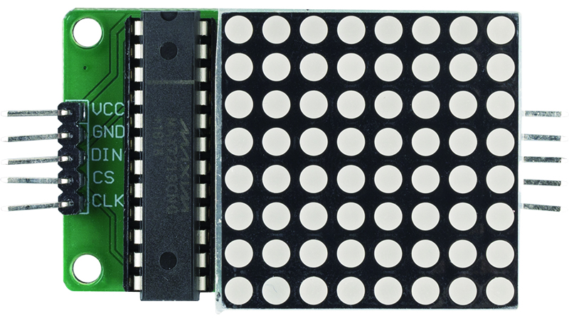
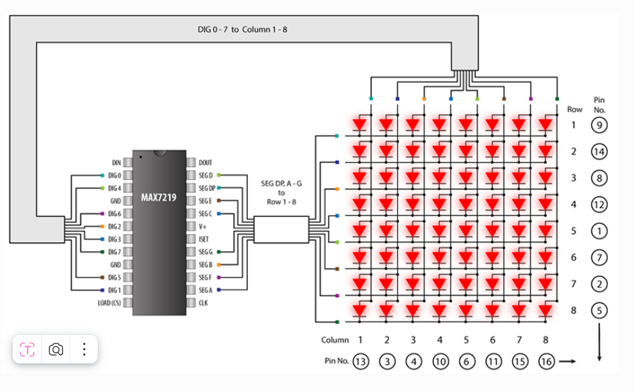

Модуль светодиодной матрицы
==============================

Это модуль матрицы 8x8 с общим катодом, управляемый микросхемой MAX7219. Рабочее напряжение модуля — 5 В. Размер — 50 мм x 32 мм x 15 мм. Левый разъём — входной порт, правый — выходной порт. Поддерживается каскадное соединение нескольких модулей.

* **VCC**: Питание. Подключается к +5В.
* **GND**: Земля (оба контакта GND должны быть подключены).
* **DIN**: Последовательный вход данных. Данные загружаются во внутренний 16-битный сдвиговый регистр по фронту сигнала CLK.
* **CS**: Вход выбора микросхемы (Chip Select). Пока CS в низком уровне, происходит загрузка последовательных данных. По фронту сигнала CS последние 16 бит фиксируются.
* **CLK**: Последовательный тактовый сигнал. Максимальная частота — 10 МГц. По фронту CLK данные загружаются в регистр, по спаду CLK данные выводятся из DOUT. В MAX7221 вход CLK активен только при низком уровне CS.

**MAX7219**

MAX7219 — это компактный драйвер дисплея с последовательным входом/выходом и общим катодом, предназначенный для подключения микроконтроллеров к 7-сегментным цифровым дисплеям (до 8 разрядов), светодиодным линейкам или 64 отдельным светодиодам. Встроенные функции включают BCD-декодер, мультиплексирующую схему сканирования, драйверы сегментов и разрядов, а также статическую память 8x8, хранящую данные дисплея.

Для установки тока сегмента всех светодиодов требуется только один внешний резистор. Микросхема MAX7221 совместима с интерфейсами SPI™, QSPI™, MICROWIRE™, и имеет ограничение скорости нарастания сигнала для снижения ЭМИ.

Удобный 4-проводный последовательный интерфейс подходит ко всем популярным микроконтроллерам. Каждый разряд может быть адресован и обновлён независимо, без необходимости переписывания всего дисплея. MAX7219/MAX7221 также позволяют выбирать B-кодировку или отображение "как есть" для каждого разряда.

* `MAX7219 Datasheet <https://datasheets.maximintegrated.com/en/ds/MAX7219-MAX7221.pdf>`_

**Примеры**

