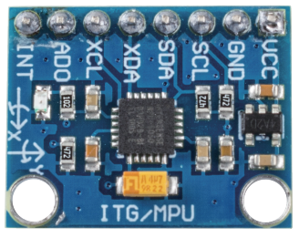
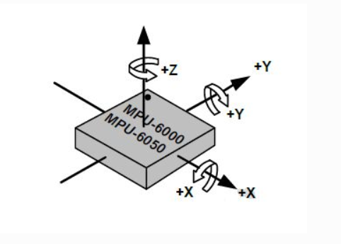
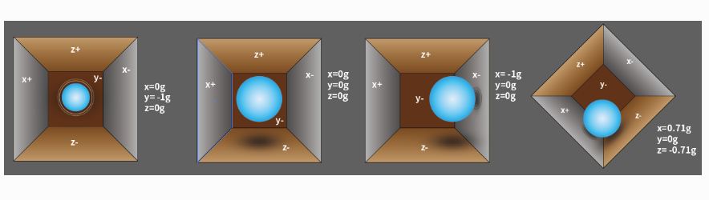
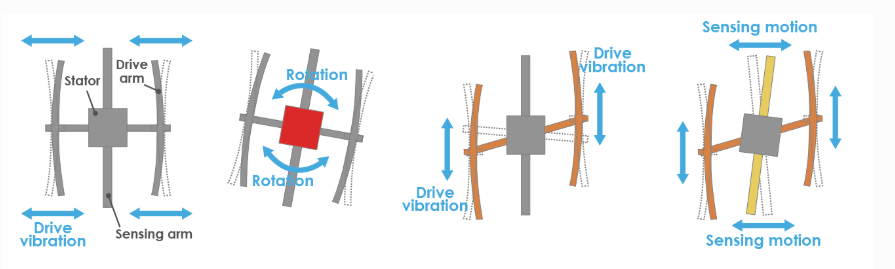

Модуль MPU6050
===================

MPU-6050 — это 6-осевой модуль (совмещает 3-осевой гироскоп и 3-осевой акселерометр) для отслеживания движений.

Его три координатные оси определяются следующим образом:

Положите MPU6050 горизонтально на стол, убедитесь, что сторона с наклейкой смотрит вверх, а точка на этой стороне находится в верхнем левом углу. Вертикальное направление вверх — это ось Z. Направление слева направо считается осью X. Соответственно, направление сзади наперед — это ось Y.

**3-осевой акселерометр**

Акселерометр работает на основе пьезоэлектрического эффекта — способности некоторых материалов генерировать электрический заряд в ответ на механическое давление.

Представьте прямоугольную коробку с шариком внутри, как показано на рисунке выше. Стенки этой коробки сделаны из пьезоэлектрических кристаллов. Когда вы наклоняете коробку, шарик перемещается по направлению наклона под действием силы тяжести. Стенка, с которой сталкивается шарик, генерирует небольшой пьезоэлектрический ток. Всего в коробке три пары противоположных стенок, каждая пара соответствует одной из осей в 3D пространстве: X, Y и Z. В зависимости от тока, создаваемого стенками, можно определить направление и величину наклона.

С помощью MPU6050 можно определить ускорение по каждой координатной оси (в состоянии покоя на столе ускорение по оси Z равно 1g, по осям X и Y — 0g). При наклоне или в условиях невесомости/перегрузки показания будут изменяться.

Существует четыре диапазона измерений, которые можно выбрать программно: ±2g, ±4g, ±8g и ±16g (по умолчанию ±2g). Значения варьируются от -32768 до 32767.

Показания акселерометра преобразуются в значение ускорения с помощью следующей формулы:

Ускорение = (Сырые данные оси акселерометра / 65536 * полный диапазон) g

Например, если сырые данные по оси X равны 16384, а выбран диапазон ±2g:

**Ускорение по оси X = (16384 / 65536 * 4) g = 1g**

**3-осевой гироскоп**

Гироскоп работает по принципу ускорения Кориолиса. Представьте вилкообразную структуру, которая постоянно движется взад-вперед. Она удерживается пьезоэлектрическими кристаллами. Когда вы наклоняете конструкцию, кристаллы испытывают силу в направлении наклона — это результат инерции движущихся частей. Кристаллы, в свою очередь, генерируют ток в соответствии с пьезоэлектрическим эффектом, который затем усиливается.

Гироскоп также имеет четыре диапазона измерения: ±250, ±500, ±1000, ±2000 °/с. Метод расчёта аналогичен акселерометру.

Формула преобразования:

Угловая скорость = (Сырые данные гироскопа / 65536 * полный диапазон) °/с

Например, если данные по оси X равны 16384, а выбран диапазон ±250 °/с:

**Угловая скорость по оси X = (16384 / 65536 * 500)°/с = 125°/с**

Примеры
-------

* :doc:`Работа с MPU6050 </circuitPythonLessons/module1/lesson15/mpu6050>`
* :doc:`3D веб визуализация MPU6050 </circuitPythonLessons/module2/lesson15/webmpu>`
