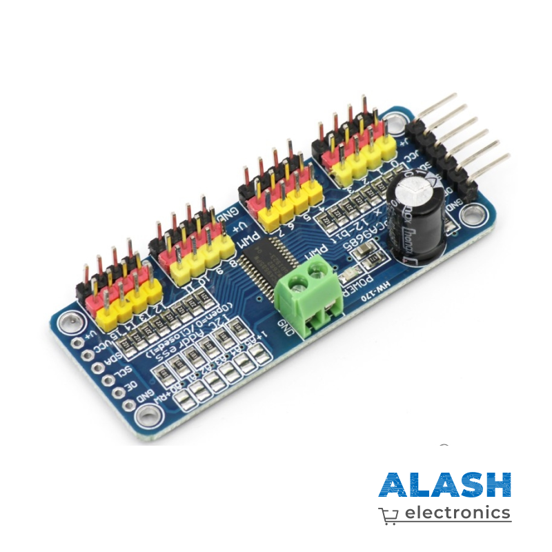

PCA9685 (16-канальный PWM-контроллер)
=====================================

**Описание**

PCA9685 — это 16-канальный ШИМ-контроллер с интерфейсом **I²C**,
позволяющий управлять светодиодами, сервоприводами и другими
устройствами, требующими широтно-импульсной модуляции.  
Встроенный 12-битный таймер и отдельный регистр периода обеспечивают
разрешение до **4096** шагов на канал, при этом базовая частота ШИМ
может задаваться в диапазоне **~24 Гц – 1526 Гц**.

Поскольку генерация ШИМ выполняется аппаратно, микроконтроллер
освобождается от постоянного обновления сигнала, а все 16 каналов
работают параллельно с одинаковой или независимой фазой.

**Выводы модуля**

================  ==========================================
VCC               Питание логики 3.0 – 5.5 V  
GND               Общий провод  
SCL               Такт I²C (до 1 Мбит/с)  
SDA               Данные I²C  
OE                Output Enable (активный LOW, обычно подтянут к GND)  
V+                Внешнее питание нагрузки (до 6 V для сервоприводов)  
PWM0 … PWM15      16 выходных ШИМ-каналов  
A0 … A5           Адресные джамперы I²C  
================  ==========================================

**Адрес I²C**

Базовый адрес 0x40. С помощью перемычек **A0–A5** можно задать
до 64 уникальных адресов (**0x40–0x7F**), что позволяет
подключить несколько плат PCA9685 к одной шине.

**Особенности**

* 16 независимых каналов, 12-бит (0 – 4095)  
* Регистры **ON** и **OFF** для каждого канала позволяют задавать
  сдвиг фазы и ширину импульса  
* Общий предделитель частоты (программируется в регистре **PRE_SCALE**)  
* Выходы открытый коллектор, выдерживают до 25 мА на канал  
* Поддержка режима «автоинкремента» для быстрой записи сразу
  в несколько регистров  
* Совместим с логическими уровнями 3.3 V и 5 V

.. note::

   Для питания сервоприводов подключите **V+** к отдельному источнику
   5–6 V, а землю этого источника объедините с **GND** платы
   микроконтроллера.

* `PCA9685 Datasheet <https://cdn-shop.adafruit.com/datasheets/PCA9685.pdf>`_

**Примеры**

* :ref:`2.2.6_c` — проект на C  
* :ref:`4.1.7_py` — проект на Python
