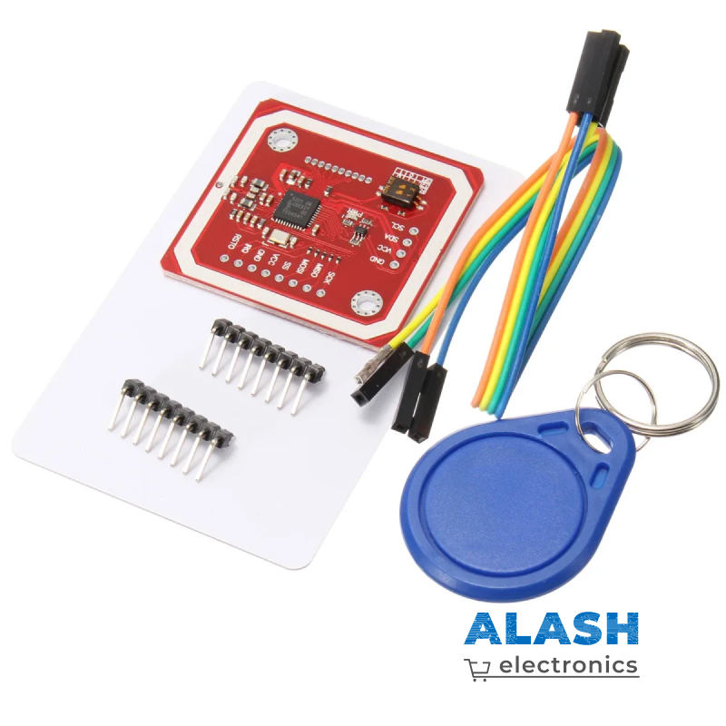

PN532 (NFC/RFID Reader)
===========================

**Описание**

PN532 — популярный многопротокольный контроллер NFC от NXP,
поддерживающий **ISO/IEC 14443 A/B**, **FeliCa**, а также режимы
кард-эмуляции и peer-to-peer (**NFC IP-1**). Модуль может
подключаться через **I²C**, **SPI** или **UART**, что делает его
универсальным решением для проектов с Raspberry Pi, ESP32, Arduino.

**Выводы (режим I²C)**

* **VCC** — питание 3.3 … 5 V  
* **GND** — общий провод  
* **SDA** — данные I²C  
* **SCL** — такт I²C  
* **RSTO** — сброс (активный LOW)  
* **IRQ** — прерывание (LOW при событии)  
* (Выводы SPI/UART присутствуют, если переключить модульными
  джамперами — см. silk)

**Принцип работы**

PN532 содержит радиопередатчик 13.56 MHz, приёмник и блок криптографии.
Для чтения метки «MIFARE Classic» контроллер:

1. Запрашивает список карт в поле (команда **InListPassiveTarget**).  
2. При получении UID выполняет антиколлизию.  
3. Аутентифицирует сектор и читает/записывает блоки памяти.  

В режиме **card emulation** PN532 сам отвечает на запросы считывателя,
эмитируя карту.

.. note::

   I²C-адрес фиксирован: **0x24** (7-бит)  
   IRQ — утягивается в LOW, когда доступны данные в FIFO.

* `PN532 Datasheet <https://www.nxp.com/docs/en/nxp/data-sheets/PN532.pdf>`_

**Примеры**

* :ref:`2.2.10_c` (C Project)
* :ref:`4.1.11_py` (Python Project)
