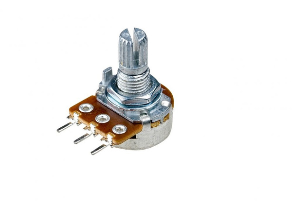
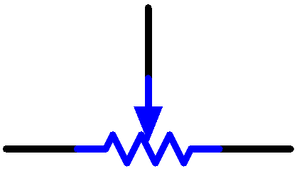

Потенциометр
=============

Потенциометр — это резистивный компонент с тремя выводами, значение сопротивления которого можно регулировать по определённому закону. 

Потенциометры бывают разных форм, размеров и номиналов, но у всех есть общие черты:

* У них есть три вывода (точки подключения).
* У них есть ручка, винт или слайдер, с помощью которых можно изменять сопротивление между средним выводом и одним из крайних.
* Сопротивление между средним выводом и одним из крайних изменяется от 0 Ом до максимального значения сопротивления потенциометра в зависимости от положения ручки или слайдера.

Вот схематическое обозначение потенциометра:

Назначения потенциометра в цепи:

#. **Делитель напряжения**

    Потенциометр — это плавно регулируемый резистор. При вращении вала или перемещении ползунка, подвижный контакт скользит по резистивной дорожке. В результате можно получить выходное напряжение, которое зависит от подаваемого на потенциометр напряжения и угла поворота подвижного контакта.

#. **Реостат (переменный резистор)**

    Если использовать потенциометр как реостат, то в цепи соединяют средний вывод и один из крайних. Таким образом можно плавно изменять сопротивление в пределах хода подвижного контакта.

#. **Регулятор тока**

    Когда потенциометр используется для управления током, то подвижный контакт должен быть подключён как один из выходных выводов.

Если вы хотите узнать больше, см. статью: `Потенциометр — Википедия <https://ru.wikipedia.org/wiki/Потенциометр>`_

Примеры
-------

* :doc:`Модуль потенциометра ADS1115 </circuitPythonLessons/module1/lesson13/pot>`
* :doc:`Потенциометр и веб-интерфейс </circuitPythonLessons/module2/lesson13/webpot>`

