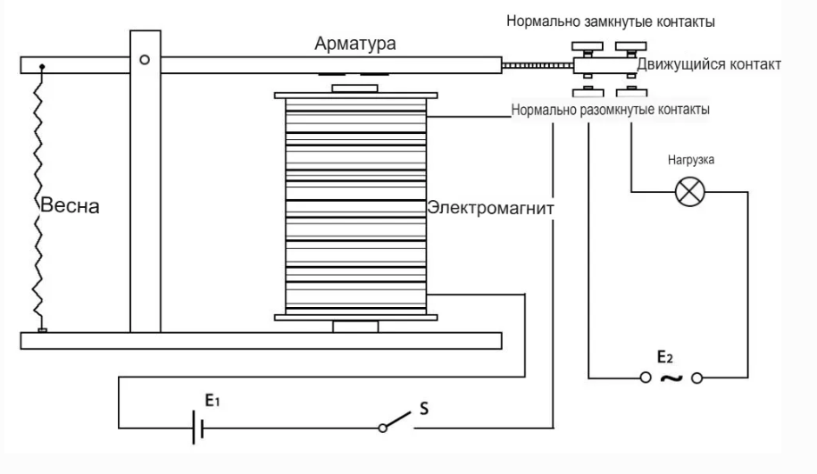

Реле
==========================================

.. image:: images/relay_pic.png
   :width: 200
   :align: center

**Реле** — это устройство, замыкающее или размыкающее цепь в ответ на
управляющий сигнал. Оно обеспечивает гальваническую развязку между
контроллером (микроконтроллером) и нагрузкой, которая может питаться как
постоянным, так и переменным током. Тем самым реле позволяет
невысоким управляющим сигналом переключать цепи с существенно большим
током или напряжением.

---

Устройство реле
---------------

Каждое электромеханическое реле содержит пять ключевых элементов:

* **Электромагнит**  
  Катушка, намотанная на железный сердечник. При подаче тока становится
  магнитом.

* **Якорь (Armature)**  
  Подвижная магнитная пластина. Под действием магнитного поля притягивает
  контакты, замыкая или размыкая цепь. Работает как на постоянном,
  так и на переменном токе.

* **Пружина**  
  Возвращает якорь в исходное положение, когда катушка
  обесточена.

* **Контакты**  
  Две группы:

  - **Нормально разомкнутые (NO)** — замыкаются, когда реле сработало.  
  - **Нормально замкнутые (NC)** — размыкаются, когда реле сработало.

* **Корпус**  
  Пластиковый кожух, защищающий элементы реле.

---

Принцип работы
--------------

#. На катушку подаётся напряжение → ток создаёт магнитное поле.  
#. Электромагнит притягивает якорь, который перемещает подвижный контакт.  
#. Контакт замыкается с группой **NO** (или размыкается с **NC**) —
   цепь нагрузки включена.  
#. При снятии питания пружина возвращает якорь, и контакты
   возвращаются в исходное состояние.

Таким образом, замыкая и размыкая цепь катушки, мы управляем состоянием
силовой цепи нагрузки.

---

**Примеры**

* :ref:`1.3.3_c` — проект на C  
* :ref:`1.3.3_py` — проект на Python

