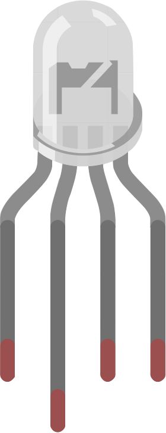
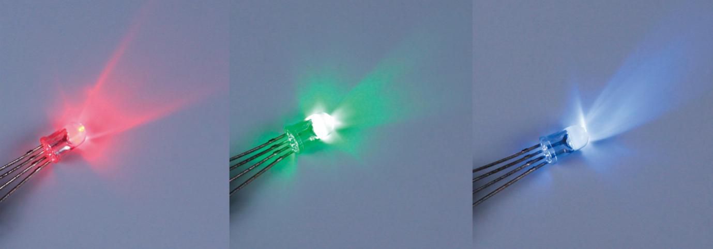
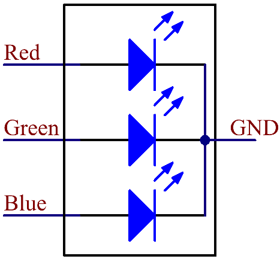

RGB-светодиод
=============

   RGB-светодиод

RGB-светодиод объединяет три кристалла — красный (R), зелёный (G) и синий (B) — в одном прозрачном
или полупрозрачном корпусе. Изменяя напряжение (ШИМ-сигнал) на трёх выводах, можно смешивать цвета
и получить до **16 777 216** оттенков.

Светодиоды бывают **общего анода** (CA) и **общего катода** (CC).
В нашем наборе используется вариант с общим катодом: все катоды трёх кристаллов соединены вместе и
подключаются к GND. Чтобы зажечь нужный цвет, подайте уровень HIGH на соответствующий анод.

Условное обозначение RGB-светодиода.

RGB-светодиод имеет четыре вывода: самый длинный — **GND**,
остальные — **Red**, **Green** и **Blue**. Ориентироваться удобно по выемке на корпусе:
ближайший к ней вывод — **Red**, далее по часовой стрелке GND, Green, Blue.

.. figure:: images/rgb_pin.jpg
   :width: 200px
   :align: center

Примеры проектов
----------------

* `RGB-светодиод (Python) </circuitPythonLessons/module1/lesson3/rgb.rst>`_
* `RGB-веб-светодиод (C) </circuitPythonLessons/module2/lesson3/webrgb.rst>`_
