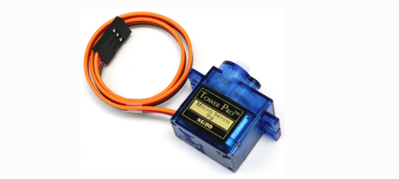
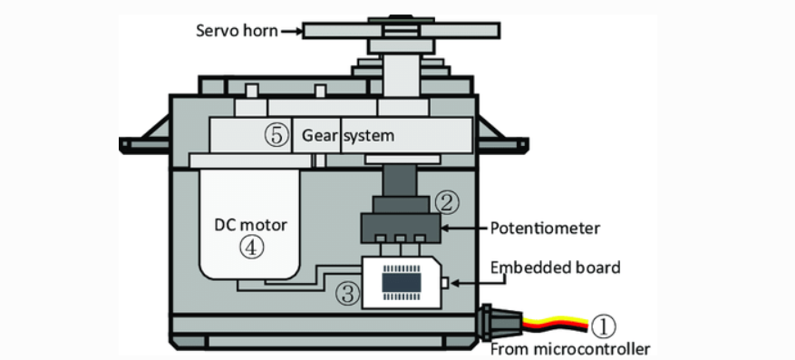
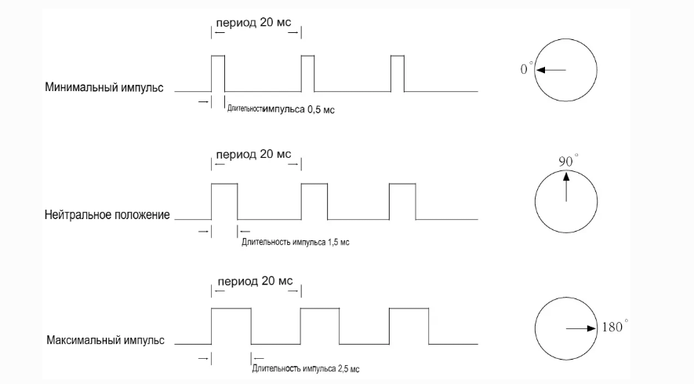

Сервопривод
===========

Сервопривод обычно состоит из следующих частей: корпус, вал, редукторная система, потенциометр, двигатель постоянного тока и встроенная плата управления.  

Принцип его работы таков: микроконтроллер посылает на сервопривод ШИМ-сигналы, которые принимаются встроенной платой через сигнальный пин. Эта плата управляет двигателем, который, в свою очередь, приводит в движение редукторную систему, а та вращает вал после понижения оборотов. Вал сервопривода соединён с потенциометром. Когда вал вращается, он также поворачивает потенциометр, который передаёт сигнал напряжения на встроенную плату. Плата определяет направление и скорость вращения на основе текущей позиции, позволяя валу точно остановиться в заданной точке и удерживать её.

1. **Сигнальный кабель** — получает ШИМ-сигналы от микроконтроллера (ESP32, Arduino и т.д.)  
2. **Потенциометр** — измеряет текущую позицию выходного вала  
3. **Встроенная плата** — анализирует полученный сигнал и данные с потенциометра, управляет двигателем  
4. **Двигатель постоянного тока** — приводит в движение шестерни  
5. **Редукторная система (Gear system)** — понижает скорость вращения двигателя и увеличивает точность позиционирования

Угол поворота задаётся длительностью импульса, подаваемого на сигнальный провод. Это называется широтно-импульсной модуляцией (ШИМ). Сервопривод ожидает импульс каждые 20 мс. Длина импульса определяет, насколько повернётся двигатель. Например, импульс длиной 1.5 мс установит вал в положение 90 градусов (нейтральное положение).  
Если длительность импульса меньше 1.5 мс, вал поворачивается против часовой стрелки от нейтральной точки. Если длительность больше 1.5 мс — по часовой стрелке. Минимальная и максимальная ширина импульса, при которых сервопривод реагирует, варьируется от модели к модели. Как правило, минимальное значение — около 0.5 мс, максимальное — около 2.5 мс.

**Примеры**

