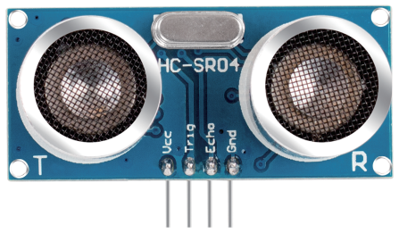
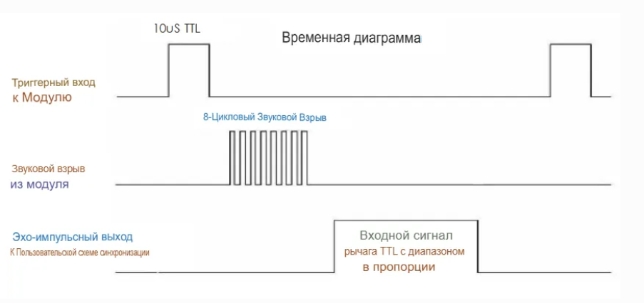

Ультразвуковой датчик расстояния (HC-SR04)
==========================================

Датчик HC-SR04 измеряет расстояние до преграды без контакта в диапазоне
**2 см – 400 см** с типовой погрешностью **±3 мм**.  
Сигнал остаётся стабильным до ≈ 5 м, после чего постепенно ослабевает и
полностью пропадает примерно на 7 м.

Основы работы
-------------

#. **Запуск измерения** — подайте на вывод **TRIG** импульс высокого уровня
   продолжительностью ≥ 10 мкс.

#. Модуль автоматически сформирует серию из 8 ультразвуковых импульсов
   частотой **40 кГц**.

#. Отражённая волна принимается датчиком, и на выводе **ECHO** появляется
   высокий уровень. Длительность этого уровня равна времени
   распространения сигнала «туда-обратно».

#. Расстояние вычисляется по формуле  

   .. math::

      D = \frac{t \times v}{2}

   где  

   * :math:`t` — длительность импульса на **ECHO** (с),  
   * :math:`v` — скорость звука (≈ 340 м/с).

   В упрощённом виде:  

   * **D (см) = t (мкс) / 58**  
   * **D (дюймы) = t (мкс) / 148**

.. tip::

   Между запусками измерений выдерживайте **≥ 60 мс**,
   чтобы эхо предыдущего импульса не мешало следующему.

Выводы модуля
-------------

================  =======================================================
VCC (5 В)         Питание +5 В  
TRIG              Вход запуска; импульс ≥ 10 мкс  
ECHO              Выход эхо-сигнала; длительность ∝ расстоянию  
GND               Общий провод  
================  =======================================================

Диапазоны и точность
--------------------

* **2 см … 5 м** — надёжное измерение  
* **5 м … 7 м** — сигнал постепенно затухает  
* **> 7 м** — эхо, как правило, не фиксируется  

Типовая погрешность — **±3 мм** в центральной части диапазона.

Примеры
-------

* :doc:`Ультразвуковой датчик HC-SR04 </circuitPythonLessons/module1/lesson7/hsr04>`
* :doc:`Веб ультразвуковая страница </circuitPythonLessons/module2/lesson7/hcsr04web>`
