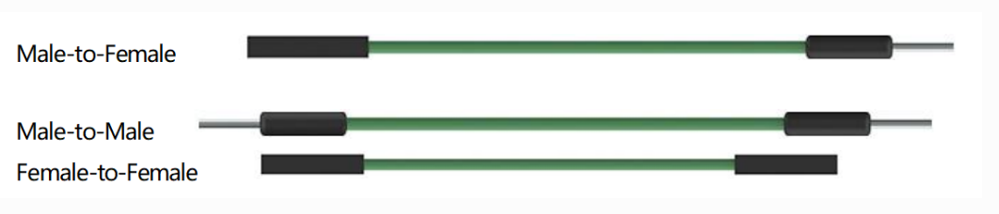

Провода-перемычки
=================

Провода, соединяющие два контакта, называются проводами-перемычками
(*jumper wires*). Существует несколько разновидностей, но в контексте
макетной платы (breadboard) нас интересуют именно они: с их помощью
электрические сигналы передаются от любой точки платы к
входным/выходным пинам микроконтроллера.

Концы перемычек вставляются в отверстия макетной платы. Под
поверхностью расположены параллельные металлические шины, которые
соединяют отверстия строками или столбцами (в зависимости от зоны
платы). Монтаж выполняется **без пайки** — достаточно вставить
«коннектор» провода именно в те отверстия, которые нужно связать в
прототипе.

Различают три типа перемычек:

* **Female-to-Female (FF)** — обе стороны «гнездо» (female);  
* **Male-to-Male (MM)** — обе стороны «штекер» (male);  
* **Male-to-Female (MF)** — один конец штекер, другой гнездо.

Обозначения «male» и «female» взяты по аналогии со штекерами: штекер
имеет выступающий штырь, а гнездо — углубление.

В одном проекте часто используют сразу несколько типов перемычек. Цвет
изоляции выбирают для удобства: электрических различий между красным и
синим проводом нет, но так легче отслеживать соединения и логику
схемы.
